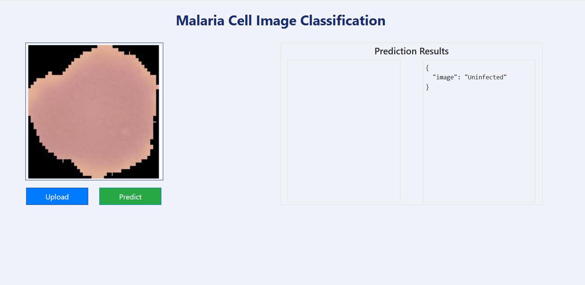
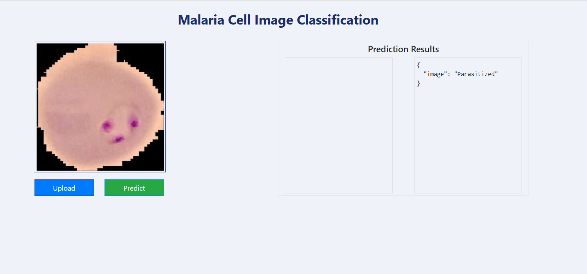

# **Malaria Diagnosis with Convolutional Neural Networks**

This project leverages Convolutional Neural Networks (CNNs) to classify blood cell images as either infected (parasitized) or uninfected with malaria. Achieving an accuracy of **94%**, this solution demonstrates the use of modern machine learning techniques and MLOps principles to build a robust, modular, and collaborative pipeline.

## **Key Features**
- **High Accuracy**: Achieved 94% classification accuracy on the dataset.
- **End-to-End Pipeline**: Built modular pipelines for:
  - **Data Ingestion**: Loading and managing the dataset.
  - **Data Processing**: Preprocessing images and applying data augmentation.
  - **Model Training**: Custom training routines with learning rate scheduling and regularization.
  - **Model Evaluation**: Evaluating model performance using test data.
- **MLOps Principles**: Designed for **reproducibility** and **collaboration**:
  - Modular and reusable code.
  - Streamlined pipelines for clear separation of tasks and used DVC to keep track of the pipelines 
  - Scalable and extensible for future improvements.
- **Technologies Used**:
  - **TensorFlow** and **Keras**: Model development and training.
  - **Matplotlib**: Data visualization and analysis.
  - **Flask**: To make a user friendly web application
  - **DVC**: To keep track of the pipelines and models for reproducibility and traceability
  - **Jupyter Notebook**: For initial prototyping and testing.

## **Project Workflow**

### 1. **Initial Prototyping**
- Explored and visualized the dataset and tested early CNN models in **Jupyter Notebook** (research/MalariaDiagnosis.ipynb).
- Fine-tuned hyperparameters, implemented **data augmentation**, and evaluated initial performance.

### 2. **End-to-End Pipeline**
- Transitioned to a **modular pipeline structure** for scalability and collaboration:
  - **Data Ingestion**: Reads and prepares data for training and testing.
  - **Data Processing**: Applies transformations like resizing, normalization, and augmentation.
  - **Training**: Trains the CNN using the ADAM optimizer and learning rate scheduling for better performance.
  - **Evaluation**: Validates the model's accuracy and loss on test data.

### 3. **Model Features**
- **Data Augmentation**: Increases dataset diversity with techniques like flipping and rotation.
- **Learning Rate Scheduling**: Dynamically adjusts the learning rate during training to optimize convergence.
- **Custom Callbacks**: Monitors performance metrics and enables early stopping to prevent overfitting.

# Flask App

A wep application was made using Flask to provide a user friendly way to upload cell images and get a prediction from the model. 
Below are two images from the wep application: with a cell that is uninfected and one with a parasitized cell. 

## **Example: Uninfected Cell**


## **Example: Parasitized Cell**


# How to run?
### STEPS:

Clone the repository

```bash
git clone https://github.com/Ayushpatel2026/cnn-malaria
```
### STEP 01- Create a conda environment after opening the repository

```bash
conda create -n cnn-malaria python=3.9 -y
```

```bash
conda activate cnn-malaria
```


### STEP 02- install the requirements
```bash
pip install -r requirements.txt
```

```bash
# Finally run the following command
python app.py
```
Now, open up the application on your local host and port
